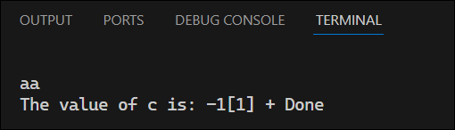
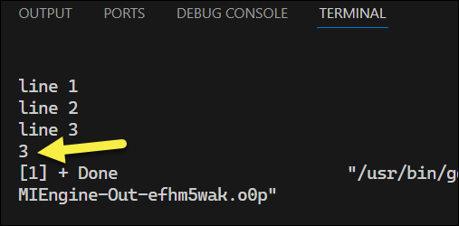
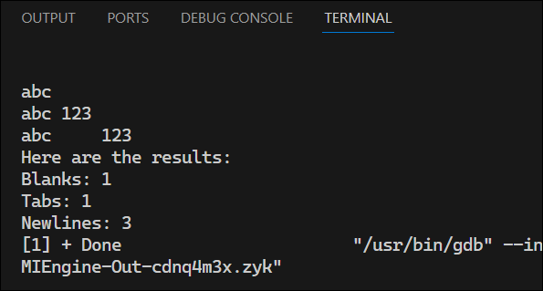
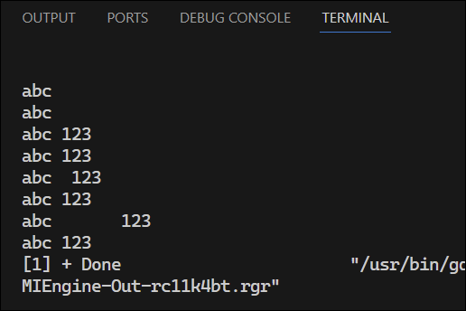
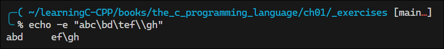
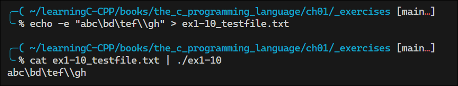

# The C Programming Language


<!-- omit in toc -->
## Contents

- [1. A Tutorial Introduction](#1-a-tutorial-introduction)
  - [1.2 Variables and Arithmetic Expressions](#12-variables-and-arithmetic-expressions)
  - [1.3 The `for` Statement](#13-the-for-statement)
  - [1.4 Symbolic Constants](#14-symbolic-constants)
  - [1.5 Character Input and Output](#15-character-input-and-output)
    - [1.5.1 File Copying](#151-file-copying)
    - [1.5.2 Character Counting](#152-character-counting)
    - [1.5.3 Line Counting](#153-line-counting)
- [2. Types, Operators, and Expressions](#2-types-operators-and-expressions)
  - [Data Types and Sizes](#data-types-and-sizes)


## 1. A Tutorial Introduction

The Hello, World! example:

```c
#include <stdio.h>

main()
{
    printf("hello, world\n");
}
```
See [`hello.c`](./ch01/hello_world/hello.c).

### 1.2 Variables and Arithmetic Expressions

Temperature conversion using integer variables:

```c
main()
{
    int fahr, celsius;
    int lower, upper, step;

    lower = 0;
    upper = 300;
    step = 20;
    fahr = lower;

    while (fahr <= upper)
    {
        celsius = 5 * (fahr - 32) / 9;
        printf("%3d\t%6d\n", fahr, celsius);
        fahr = fahr + step;
    }
}
```
See [`1-temp-integer.c`](./ch01/temperature/1-temp-integer.c).

Things to note:
- The `main()` function does not have a return type. In C, the default return type is `int`, so it is better to declare it as `int main()`.
- The `printf()` function is used to print formatted output. The format string specifies how the output should be formatted.
- The `%d` format specifier is used for integers, and `%f` is used for floating-point numbers.
- The expression `5 * (fahr - 32) / 9` performs integer division, which may lead to loss of precision. To avoid this, you can use floating-point arithmetic.

Temperature conversion using floating-point variables:

```c
main()
{
    float fahr, celsius;
    float lower, upper, step;

    lower = 0;
    upper = 300;
    step = 20;
    fahr = lower;
    printf("Fahrenheit to Celsius Conversion Table\n");
    while (fahr <= upper)
    {
        celsius = (5.0 / 9.0) * (fahr - 32);
        printf("%3.0f\t%6.1f\n", fahr, celsius);
        fahr = fahr + step;
    }
}
```
See [`2-temp-float.c`](./ch01/temperature/2-temp-float.c).

Using the `printf()` function:

| Format | Description                                                        |
| ------ | ------------------------------------------------------------------ |
| %d     | print as decimal integer                                           |
| %6d    | print as decimal integer, at least 6 characters wide               |
| %f     | print as floating point                                            |
| %6f    | print as floating point, at least 6 characters wide                |
| %.2f   | print as floating point, 2 characters after decimal point          |
| %6.2f  | print as floating point, at least 6 wide and 2 after decimal point |

### 1.3 The `for` Statement

Temperature conversion using the `for` statement:

```c
int main()
{
    int fahr;
    for (fahr = 0; fahr <= 300; fahr += 20)
    {
        printf("%3d %6.1f\n", fahr, (5.0 / 9.0) * (fahr - 32));
    }
}
```
See [`4-temp-conversion-for.c`](./ch01/temperature/4-temp-conversion-for.c).

Things to note:
- The choice between `while` and `for` is aribrary, based on which seems clearer.
- The `for` statement is usually appropriate for loops in which the initialization and increment are single statements and logically related.

### 1.4 Symbolic Constants

Use `#define` to define symbolic constants:

```
#define <name> <replacement text>

```
Things to note:
- The replacement text can be any sequence of characters, including numbers, letters, and punctuation.

Temperature conversion using symbolic constants:

```c
#include <stdio.h>

#define LOWER 0
#define UPPER 300
#define STEP 20

int main()
{
    int fahr;
    for (fahr = LOWER; fahr <= UPPER; fahr += STEP)
    {
        printf("%3d %6.1f\n", fahr, (5.0 / 9.0) * (fahr - 32));
    }
}
```
See [6-temp-using-defines.c](./ch01/temperature/6-temp-using-defines.c).

### 1.5 Character Input and Output

- A *text stream* is a sequence of characters divided into lines; each line consists of zero or more characters followed by a newline.
- `getchar()` and `putchar()` are the simplest library functions for reading and writing characters.
- `getchar()` reads the next character from the input stream and returns it as an `int`. It returns `EOF` when the end of the file is reached.
- `putchar()` writes a character (converted to an unsigned char) to the output stream and returns it as an `int`. It returns `EOF` if an error occurs.

#### 1.5.1 File Copying

In the following program, `c` is declared as an `int` so that it can accommodate the value of `EOF`, which is typically defined as -1. If `c` were declared as a `char`, it would not be able to hold the value of `EOF`, and the program would not work correctly.

```c
#include <stdio.h>

int main() {
    int c;                        // Variable to store each character read from input

    c = getchar();                // Read the first character from input
    while (c != EOF) {            // Loop until End Of File (EOF) is encountered
        putchar(c);               // Output the character to standard output
        c = getchar();            // Read the next character from input
    }
}
```

See [`1_char.c`](./ch01/file_copying/1_char.c) for the complete code.

Expressions return a value. The expression `c = getchar()` returns the value of `c` after the assignment is made.

The following code demonstrates reading input until EOF and printing the final value of `c`:

```c
#include <stdio.h>

// Declare main function and variable for input character
int main() {
    int c;

    // Read characters from input until EOF is encountered
    while ((c = getchar()) != EOF) {
    }

    // Print the value of c after EOF is reached
    printf("The value of c is: %2d", c);
}
```
<details>
<summary>Ouput</summary>



</details>

See [`1-6e.c`](./ch01/file_copying/1-6e.c) for the complete code.

#### 1.5.2 Character Counting

The following program counts the number of characters in the input:

```c
#include <stdio.h>

int main() {
    long nc = 0;                     // Initialize character count to zero
    while (getchar() != EOF) {       // Loop until EOF is encountered
        ++nc;                        // Increment character count
        printf("%ld\n", nc);         // Print the current character count. `ld` is used for long integers.
    }
}
```
See [`1_character_count.c`](./ch01/character_counting/1_character_count.c).

Things to note:
- The program accumulates the count in a variable `nc` of type `long` instead of `int` to avoid overflow for large inputs.
- The conversion specifier `%ld` is used to print long integers.

The following program stores bigger counts using a double (double precision float):

```c
#include <stdio.h>

int main() {
    double nc = 0;                   // Initialize character count to zero
    for (nc = 0; getchar() != EOF; ++nc) {
        // Increment character count for each input character
    }
    printf("%.0f\n", nc);            // Print the total character count without decimals
}
```
See [`2_character_count.c`](./ch01/character_counting/2_character_count.c).

Things to note:
- The body of this loop is empty because all the work is done in the `for` statement.

#### 1.5.3 Line Counting 

The next program counts input lines.

```c
int main() {
    int c, nl;
    nl = 0;
    while ((c = getchar()) != EOF)
        if (c == '\n')
            ++nl;
    printf("%d\n", nl);
}
```
See [1_line_count.c](./ch01/line_counting/1_line_count.c).

<details>
<summary>Ouput</summary>



</details>

Things to note:
- A character written between single quotes is called a *character constant*.
- A character constant represents an integer value equal to the numeric value of the character in the machine's character set.
- In this example, `'\n'` is the newline character constant, which has a value of 10 in ASCII.

**Exercise 1-8**: Write a program to count blanks, tabs, and newlines.

<details>
<summary>My Solution</summary>

```c
int main() {
    // Declare variables for character input and counters
    int character, blanks, tabs, newlines;

    // Initialize counters
    blanks = tabs = newlines = 0;

    // Process input and count blanks, tabs, and newlines
    while((character = getchar()) != EOF) {
        if (character == ' ')
            blanks++;
        if (character == '\t')
            tabs++;
        if (character == '\n')
            newlines++;
    }

    // Output the results
    printf("Here are the results: \n");
    printf("Blanks: %d\n", blanks);
    printf("Tabs: %d\n", tabs);
    printf("Newlines: %d\n", newlines);
}
```
[`ex1_8_character_count.c`](./ch01/character_counting/ex1_8_character_count.c)

**Output:**



</details>

**Exercise 1-9:** Write a program to copy its input to its output, replacing each string of one or more blanks by a single blank.

<details>
<summary>My Solution</summary>

```c
#include <stdio.h>

// Declare main function and variables for character input and blank counting
int main() {
    int c;
    int blanks;

    // Initialize blank counter and process input character by character
    blanks = 0;
    while ((c = getchar()) != EOF)
    {
        // Check for blank characters and count consecutive blanks
        if (c == ' ') {
            blanks++;
        } else {
            // Output a single blank if blanks were counted, then output the non-blank character and reset counter
            if (blanks > 0) {
                putchar(' ');
            }
            putchar(c);
            blanks = 0;
        }
    }
}
```
See [`ex1_9_squeeze_blanks.c`](./ch01/character_counting/ex1_9_squeeze_blanks.c).

**Output:**



</details>


**Exercise 1-10:** Write a program to copy its input to its output, replacing each tab by \t, each backspace by \b, and each backslash by \\. This makes tabs and backspaces visible in an unambiguous way.

<!-- <details>
<summary>My Solution</summary> -->

```c
#include <stdio.h>

int main()
{
    int character;

    /* Process input characters until EOF is encountered */
    while ((character = getchar()) != EOF)
    {
        /* Handle tab character */
        if (character == '\t')
        {
            putchar('\\');
            putchar('t');
        }
        /* Handle backspace character */
        else if (character == '\b')
        {
            putchar('\\');
            putchar('b');
        }
        /* Handle backslash character */
        else if (character == '\\')
        {
            putchar('\\');
            putchar('\\');
        }
        /* Output all other characters without modification */
        else
        {
            putchar(character);
        }
    }
}
```
[`ex1-10.c`](./ch01/_exercises/ex1-10.c)

**Output:**  

Confirm by echoing a string with tabs and backspaces:  



Then send the string to a text file and pipe it to the program:



**Note:** The program prints backspaces, tabs, and backslashes as `\b`, `\t`, and `\\` respectively. 

</details>


## 2. Types, Operators, and Expressions

- Don't begin variable names with an underscore; names with underscores are reserved for library routines.

### Data Types and Sizes

Here are the data types from K&R C:
- `char`
- `int`
- `float`
- `double`

You can specify qualifiers for some types:

```c
short int sh;
long int counter;
```

Each compiler is free to choose its appropriate sizes for these types. `short` is often 16 bits, `int` is almost universally 32 bits, and `long` is at least 32 bits.

<blockquote>
<strong>Note:</strong> A Windows `long` is 32 bits and a Linux/macOS `long` is 64 bits.
</blockquote>