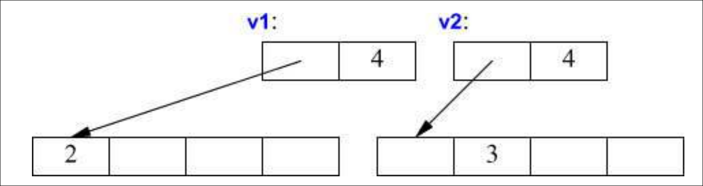

<!-- omit in toc -->
# 3. A Tour of C++ Abstraction Mechanisms
- [3.1 Introduction](#31-introduction)
- [3.2 Classes](#32-classes)
  - [3.2.1 Concrete Types](#321-concrete-types)
    - [3.2.1.1 An Arithmetic Type](#3211-an-arithmetic-type)
    - [3.2.1.2 A Container](#3212-a-container)
    - [3.2.1.3 Initializing Containers](#3213-initializing-containers)
  - [3.2.2 Abstract Types](#322-abstract-types)
  - [3.2.3 Virtual Functions](#323-virtual-functions)
  - [3.2.4 Class Hierarchies](#324-class-hierarchies)
- [3.3 Copy and Move](#33-copy-and-move)
  - [3.3.1 Copying Containers](#331-copying-containers)
  - [3.3.2 Moving Containers](#332-moving-containers)

## 3.1 Introduction

This chapter introduces C++ features for abstraction and resource management without going into detail. It shows how to define and use user-defined types, focusing on concrete classes, abstract classes, and class hierarchies. Templates are presented as a way to parameterize types and algorithms with other types and algorithms. Computations on both built-in and user-defined types appear as functions, which can be generalized into template functions or function objects. These features support object-oriented and generic programming.

The following two chapters provide examples of standard-library facilities and their usage. This chapter assumes you have prior programming experience. If not, it is recommended to first read a textbook such as *Programming: Principles and Practice Using C++* \[Stroustrup, 2009]. Even with prior experience, the language or style you know may differ greatly from what is presented here. If this quick overview feels unclear, skip ahead to the more systematic explanations starting in Chapter 6.

As in Chapter 2, this overview presents C++ as a unified language rather than separating features by origin. It does not mark which parts come from C, C++98, or C++11. That historical information can be found in §1.4 and Chapter 44.

## 3.2 Classes

The core feature of C++ is the class. A class is a user-defined type that represents a concept within a program. Whenever a design includes a useful concept or entity, it should be modeled as a class so the idea exists directly in the code, not just in our head, in documentation, or in comments.

Programs built from a well-chosen set of classes are much easier to understand and maintain than those relying only on built-in types. Libraries themselves are often collections of classes. Nearly all C++ features beyond basic types, operators, and statements exist to help define or use classes more effectively. By “better,” we mean classes that are correct, efficient, elegant, easy to use, maintain, and reason about.

Most programming techniques depend on designing and implementing specific kinds of classes. Because programmer needs and preferences vary widely, C++ offers broad support for class design. This chapter focuses on three key kinds: concrete classes (§3.2.1), abstract classes (§3.2.2), and classes in hierarchies (§3.2.4). A remarkable number of useful classes fall into these categories, while many others are variations or combinations of these basic forms.

### 3.2.1 Concrete Types

Concrete classes are designed to behave like built-in types. For example, a complex number type or an infinite-precision integer works much like an `int`, though with its own semantics and operations. Likewise, `vector` and `string` resemble arrays but offer safer and more consistent behavior.

The key property of a concrete type is that its representation is part of its definition. In many cases—such as `vector`—this representation may just be one or more pointers to data stored elsewhere, but every object still contains that representation. This enables efficient use of time and space. Specifically, concrete types allow us to:

* place objects on the stack, in static memory, or inside other objects (§6.4.2)
* refer to objects directly, not just through pointers or references
* initialize objects fully and immediately using constructors (§2.3.2)
* copy objects (§3.3)

The representation can be private and accessible only through member functions, as in `Vector`. Still, it is present in each object, meaning that significant representation changes require recompilation. This tradeoff is worthwhile for types that rarely change, since local variables benefit from the clarity and efficiency of concrete classes.

To improve flexibility, a concrete class may store much of its data in dynamic memory while keeping only a handle inside the class object itself. This is how `vector` and `string` are implemented—they serve as resource handles with carefully designed interfaces.

#### 3.2.1.1 An Arithmetic Type

The “classic user-defined arithmetic type” is `complex`:

```cpp
class complex {
    double re, im;                                  // representation: two doubles
public:
    complex(double r, double i) : re{r}, im{i} {}   // construct from two scalars, using list-form initilization
    complex(double r) : re{r}, im{0} {}             // construct from one scalar
    complex() : re{0}, im{0} {}                     // default constructor {0,0}

    double real() const { return re; }              // const specifier means this function does not modify the object
    void real(double d) { re = d; }

    double imag() const { return im; }
    void imag(double d) { im = d; }

    // Introducing the operator keyword 
    complex& operator+=(complex z) { re += z.re; im += z.im; return *this; }   
    complex& operator-=(complex z) { re -= z.re; im -= z.im; return *this; }

    complex& operator*=(complex);                   // defined elsewhere
    complex& operator/=(complex);                   // defined elsewhere
};
```

This simplified version of the standard-library `complex` (§40.4) defines only the operations that need direct access to its representation. The design is conventional and efficient, partly because of compatibility with Fortran conventions. Efficiency requires inlining simple operations like constructors, `+=`, and accessors. In C++, functions defined inside a class are inlined by default. The default constructor `complex()` ensures no variables of this type remain uninitialized. The `const` specifier on `real()` and `imag()` means those functions do not modify the object.

Many useful operations don’t need direct access to the representation, so they can be defined outside the class:

```cpp
complex operator+(complex a, complex b) { return a += b; }
complex operator-(complex a, complex b) { return a -= b; }
complex operator-(complex a) { return { -a.real(), -a.imag() }; }   // unary minus
complex operator*(complex a, complex b) { return a *= b; }
complex operator/(complex a, complex b) { return a /= b; }
```

Here, parameters are passed by value, creating local copies. This allows modification inside the function without affecting the caller’s objects, and the modified copy is returned as the result. Equality operators are straightforward:

```cpp
bool operator==(complex a, complex b) {                     // Parameters passed by value, creating local copies
    return a.real() == b.real() && a.imag() == b.imag();
}

bool operator!=(complex a, complex b) {
    return !(a == b);                                       // Modified copy is returned as the result
}
```

Additional operations like `sqrt(complex)` can also be defined.

Usage example:

```cpp
void f(complex z) {
                                                // List initialization picks the best-matching constructor
    complex a {2.3};                            // calls complex(double) with r=2.3, sets im=0
    complex b {1 / a};                          // The compiler automatically converts 1 to temporary complex{1.0,0.0}
    complex c {a + z * complex{1, 2.3}};        

    if (c != b)
        c = -(b / a) + 2 * b;
}
```

The compiler translates operator expressions into function calls. For instance, `c != b` becomes `operator!=(c, b)`, and `1 / a` becomes `operator/(complex{1}, a)`. Operator overloading should be used sparingly and in line with conventional meaning. 

C++ fixes the syntax, so you cannot invent new operators (e.g., a unary `/`), nor can you change how operators work for built-in types.

#### 3.2.1.2 A Container

A container is an object that holds a collection of elements. Vector is a container type because it stores such collections. As defined in §2.3.2, Vector is a reasonable container for doubles: it’s simple, maintains a useful invariant (i.e. consistent relationship between its members), provides range-checked access (§2.4.3.1), and has size() for iteration.

Its flaw is that it allocates memory with new but never deallocates it. This is dangerous because C++ provides only an optional garbage collector (§34.5). In many environments, a collector isn’t available, and even when it is, developers often prefer precise control over resource cleanup (§13.6.4) for logical or performance reasons. To fix this, a destructor must release any memory allocated by the constructor.

```cpp
class Vector {
private:
    double* elem;                                       // points to an array of sz doubles
    int sz;
public:
    // Uses an initializer list to initialize elem and sz before the body executes
    Vector(int s) : elem{new double[s]}, sz{s}          // constructor: acquire memory. 
    {
        for (int i = 0; i != s; ++i) elem[i] = 0;       // initialize elements
    }
    ~Vector() { delete[] elem; }                        // destructor: free memory

    double& operator[](int i);                          // & returns a reference to the i-th element. (Without a reference, it would return a copy, which is not useful for assignment.)
    int size() const;
};
```
A destructor’s name is the class name prefixed with `~`. It complements the constructor: the constructor allocates memory on the free store (heap), and the destructor frees it. Users of Vector don’t manage this directly; they just create and use objects as with built-in types.

```cpp
void fct(int n)
{
    Vector v(n);
    // ... use v ...
    {
        Vector v2(2*n);
        // ... use v and v2 ...
    }   // v2 destroyed here
    // ... use v ...
}   // v destroyed here
```

Vector follows the same rules of naming, scope, allocation, and lifetime as built-in types like int or char (§6.4). Error handling has been omitted here (§2.4.3).

The constructor/destructor pair is central to many C++ techniques. This pattern, **Resource Acquisition Is Initialization (RAII)**, ensures resources are acquired in a constructor and released in a destructor. It prevents “naked new” and “naked delete” in user code, keeping memory management inside well-designed abstractions. This reduces errors and helps avoid resource leaks (§5.2, §13.3).


#### 3.2.1.3 Initializing Containers

A container is meant to hold elements, so we need simple ways to add them. One option is to create a Vector with a fixed size and then assign values, but there are more elegant approaches. Two common ones are:

- **Initializer-list constructor:** lets you initialize a Vector with a list of elements.
- **push\_back():** adds a new element to the end of the sequence.

Example declarations:

```cpp
class Vector {
public:
    Vector(std::initializer_list<double>);     // initialize with a list
    void push_back(double);                    // add element at end, increasing size by one
    // ...
};
```

The `push_back()` function is useful when the number of elements is not known in advance.

```cpp
Vector read(istream& is)            // is stands for input stream
{
    Vector v;
    for (double d; is >> d;)       // read floating-point values into d
        v.push_back(d);            // add d to v
    return v;
}
```

The loop stops at end-of-file or on a formatting error. Until then, each number is added to v, so its size matches the number of elements read. A for-loop is used to limit the scope of d to the loop.

Efficient return of large Vectors from **read()** relies on a move constructor (see §3.3.2). The initializer-list constructor relies on std::initializer\_list, a compiler-supported standard type. When you write something like `{1,2,3,4}`, the compiler creates an initializer\_list object.

Examples:

```cpp
Vector v1 = {1,2,3,4,5};            // v1 has 5 elements. Uses std::initializer_list
Vector v2 = {1.23, 3.45, 6.7, 8};   // v2 has 4 elements
```

A possible implementation of the initializer-list constructor:

```cpp
Vector::Vector(std::initializer_list<double> lst)
    : elem{new double[lst.size()]}, sz{static_cast<int>(lst.size())}
{
    copy(lst.begin(), lst.end(), elem);    // copy elements from lst into elem
}
```

### 3.2.2 Abstract Types

Types like complex and Vector are called concrete types because their representation is part of their definition, similar to built-in types. An abstract type, in contrast, hides all implementation details. To achieve this, the interface is separated from the representation, and objects are allocated on the free store, i.e. the pool of memory you get when using `new` / `delete`, and accessed through references or pointers.

Here is an abstract interface for a container:

```cpp
class Container {
public:
    virtual double& operator[](int) = 0;   // pure virtual function
    virtual int size() const = 0;          // const member function
    virtual ~Container() {}                // virtual destructor
};
```

This class defines an interface only. The keyword virtual means a function can be redefined in a derived class. A pure virtual function (`=0`) must be implemented by a derived class. Because of that, you cannot create objects of type Container directly. A class with at least one pure virtual function is called an abstract class.

Example use:

```cpp
void use(Container& c)
{
    const int sz = c.size();
    for (int i = 0; i != sz; ++i)
        cout << c[i] << '\n';
}
```

The function use() works with any class derived from Container. It calls size() and operator\[] without knowing the underlying implementation. A type like this, which allows many implementations behind one interface, is called polymorphic.

Abstract classes usually don’t have constructors since they hold no data, but they almost always have virtual destructors. This ensures proper cleanup when deleting an object through a base-class pointer.

A concrete implementation can use Vector:

```cpp
class Vector_container : public Container {   // implements Container
    Vector v;
public:
    Vector_container(int s) : v(s) {}        // Vector with s elements
    ~Vector_container() {}
    double& operator[](int i) { return v[i]; }
    int size() const { return v.size(); }
};
```

Here, Vector\_container inherits from Container. The derived class overrides operator\[] and size(), as well as the destructor. The Vector member is automatically destroyed when Vector\_container’s destructor runs.

Example:

```cpp
void g()
{
    Vector_container vc(10);        // ten elements
    use(vc);
}
```

Because use() only knows the Container interface, it will also work with other implementations. For example:

```cpp
class List_container : public Container {
    std::list<double> ld;                                       // standard-library list of doubles
public:
    List_container() {}
    List_container(initializer_list<double> il) : ld{il} {}    // using initializer_list to initialize the list
    ~List_container() {}
    double& operator[](int i);
    int size() const { return ld.size(); }
};

double& List_container::operator[](int i)
{
    for (auto& x : ld) {                                        // List traversal takes linear time
        if (i == 0) return x;                                   
        --i;
    }
    throw out_of_range("List container");
}
```

Here the representation is a std::list<double>. Subscript access on a list is inefficient (because traversal takes linear time), but this example demonstrates how different implementations can still share the same interface.

```cpp
void h()
{
    List_container lc = {1,2,3,4,5,6,7,8,9};
    use(lc);
}
```

The function use() works equally with Vector\_container, List\_container, or any other class derived from Container. It relies only on the interface, not the implementation. This flexibility means code doesn’t need recompilation when a new derived class is added, but it also requires objects to be used through references or pointers. 

The reason it requires objects to be used through references or pointers is abstract types cannot be instantiated directly, so you cannot create a Container object. Instead, you create objects of derived classes and use them through pointers or references to the base class.

### 3.2.3 Virtual Functions

In the function

```cpp
void use(Container& c)
{
    const int sz = c.size();
    for (int i = 0; i != sz; ++i)
        cout << c[i] << '\n';
}
```

the expression `c[i]` must resolve to the correct implementation of `operator[]()`. If use() is called from h(), then `List_container::operator[]()` should run. If it is called from g(), then `Vector_container::operator[]()` should run.

This works because every object of a class with virtual functions carries information that allows the program to select the right function at runtime. The common implementation technique is the **virtual function table** (vtbl).

Each class with virtual functions has its own vtbl, which stores pointers to its virtual functions. Each object of such a class contains a hidden pointer to its class’s vtbl. When a virtual function is called, the compiler translates the function name into an index lookup in the vtbl. The correct function pointer is then called, even if the caller does not know the object’s exact type.

This setup allows polymorphic behavior while keeping overhead low. The cost is:

* One extra pointer stored in each object of a class with virtual functions.
* One vtbl per such class.

Runtime performance of a virtual function call is close to that of a regular function call—typically within about 25%.

### 3.2.4 Class Hierarchies

A class hierarchy is a set of classes related by inheritance. We use it to model “is-a” relationships, such as a fire engine being a kind of truck, or a smiley face being a kind of circle. Real systems often have large, deep hierarchies. As a small example, consider shapes on a screen.


We first define an abstract base with the common interface. Nothing except the vtable pointer layout is shared across all shapes.

```cpp
class Shape {
public:
    // pure virtual
    virtual Point center() const = 0;
    virtual void move(Point to) = 0;

    // draw on current "Canvas"
    virtual void draw() const = 0;
    virtual void rotate(int angle) = 0;

    // destructor
    virtual ~Shape() {}
    // ...
};
```

With that interface, we can write generic algorithms operating on collections of shapes.

```cpp
void rotate_all(std::vector<Shape*>& v, int angle) {
    for (auto p : v)
        p->rotate(angle);
}
```

To define a concrete shape, derive from Shape and implement the operations.

```cpp
class Circle : public Shape {
public:
    Circle(Point p, int rr);                // Constructor. rr stands for radius
    Point center() const { return x; }
    void move(Point to) { x = to; }
    void draw() const;
    void rotate(int) {}  // trivial here

private:
    Point x;  // center
    int r;    // radius
};
```

We can build further by deriving from Circle.

```cpp
class Smiley : public Circle {          // use Circle as the base for a face
public:
    Smiley(Point p, int r) : Circle{p, r}, mouth{nullptr} {}            // Note: use of brace initialization in the initializer list

    ~Smiley() {
        delete mouth;
        for (auto p : eyes) delete p;
    }

    void move(Point to);
    void draw() const;
    void rotate(int);

    void add_eye(Shape* s) { eyes.push_back(s); }
    void set_mouth(Shape* s);
    virtual void wink(int i);

private:
    std::vector<Shape*> eyes;  // usually two eyes
    Shape* mouth;
};
```

Smiley’s draw calls its base and member draws.

```cpp
void Smiley::draw() {
    Circle::draw();
    for (auto p : eyes)
        p->draw();
    mouth->draw();
}
```

A virtual destructor is essential for an abstract base because derived objects are often deleted via a base pointer. The virtual call ensures the most-derived destructor runs, which then destroys bases and members.

Derived classes can add data and behavior. This flexibility is powerful but easy to misuse. Interface inheritance lets derived objects stand in for base objects. Implementation inheritance lets derived classes reuse base code, such as Circle’s constructor or draw.

For small, concrete types we often allocate on the stack and copy freely. In hierarchies, we usually allocate on the free store and access via pointers or references. Here is a reader that constructs shapes from a stream and returns base pointers.

```cpp
enum class Kind { circle, triangle, smiley };

Shape* read_shape(std::istream& is) {
    // ... read shape header from is and determine k ...
    Kind k = /* ... */;

    switch (k) {
    case Kind::circle: {
        // read {Point,int} into p and r
        Point p; int r;
        // ...
        return new Circle{p, r};
    }
    case Kind::triangle: {
        // read {Point,Point,Point} into p1, p2, p3
        Point p1, p2, p3;
        // ...
        return new Triangle{p1, p2, p3};
    }
    case Kind::smiley: {
        // read {Point,int,Shape,Shape,Shape} into p, r, e1, e2, m
        Point p; int r; Shape* e1; Shape* e2; Shape* m;
        // ...
        Smiley* ps = new Smiley{p, r};
        ps->add_eye(e1);
        ps->add_eye(e2);
        ps->set_mouth(m);
        return ps;
    }
    }
    return nullptr;
}
```

Client code need not know the concrete types.

```cpp
void user() {
    std::vector<Shape*> v;
    while (std::cin)
        v.push_back(read_shape(std::cin));

    draw_all(v);
    rotate_all(v, 45);

    for (auto p : v) delete p;  // must delete elements
}
```

Raw owning pointers are error-prone. Callers might forget to delete returned objects, and containers of pointers might leak. Prefer unique ownership with unique\_ptr.

```cpp
std::unique_ptr<Shape> read_shape(std::istream& is) {
    // ... read shape header and determine k ...
    Kind k = /* ... */;

    switch (k) {
    case Kind::circle: {
        Point p; int r;
        // ...
        return std::unique_ptr<Shape>{new Circle{p, r}};            // Unique ptr as opposed to a raw pointer, e.g. Circle*
    }
    // handle other kinds similarly
    }
    return nullptr;
}

void user() {
    std::vector<std::unique_ptr<Shape>> v;
    while (std::cin)
        v.push_back(read_shape(std::cin));

    draw_all(v);
    rotate_all(v);
}  // shapes are destroyed automatically
```

With unique\_ptr, ownership is explicit and objects are destroyed when their owners go out of scope. To use vectors of unique\_ptr, provide overloads of the generic functions that accept them. Writing many such helpers can be tedious; see §3.4.3 for alternatives.

## 3.3 Copy and Move

By default, objects can be copied, including both built-in and user-defined types. The default copy operation is memberwise: each member is copied in turn.

```cpp
void test(complex z1)
{
    complex z2 {z1};    // copy initialization
    complex z3;
    z3 = z2;            // copy assignment
    // ...
}
```

Here, `z1`, `z2`, and `z3` all end up with the same value because both initialization and assignment copy every member.

When designing a class, we must decide whether copying should be allowed and what it should mean. For simple concrete types, memberwise copy is often correct. For more complex types like `Vector`, it usually isn’t. For abstract types, memberwise copy is almost never appropriate.

### 3.3.1 Copying Containers

When a class manages a resource through a pointer, the default memberwise copy is usually wrong. It breaks the class invariant because both objects end up referring to the same resource.

```cpp
void bad_copy(Vector& v1)
{
    Vector v2 = v1;    // memberwise copy
    v1[0] = 2;         // v2[0] also becomes 2
    v2[1] = 3;         // v1[1] also becomes 3
}
```

If `v1` has four elements, both `v1` and `v2` now share the same array. When one modifies the array, the other changes too. Worse, when both destructors run, they will each try to free the same memory.


The presence of a destructor is a strong signal that the default copy is unsafe. Instead, we must define proper copy semantics using a copy constructor and copy assignment operator.

```cpp
class Vector {
private:
    double* elem;       // points to an array of sz doubles
    int sz;

public:
    Vector(int s);                           // constructor
    ~Vector() { delete[] elem; }             // destructor

    Vector(const Vector& a);                 // copy constructor
    Vector& operator=(const Vector& a);      // copy assignment

    double& operator[](int i);
    const double& operator[](int i) const;
    int size() const;
};
```

The copy constructor allocates new space and copies elements so that each `Vector` owns its own array.

```cpp
Vector::Vector(const Vector& a)
    : elem{new double[a.sz]}, sz{a.sz}
{
    for (int i = 0; i != sz; ++i)
        elem[i] = a.elem[i];
}
```
Copy assignment follows the same idea: allocate new space, copy elements, release old space, then update the object.

```cpp
Vector& Vector::operator=(const Vector& a)
{
    double* p = new double[a.sz];
    for (int i = 0; i != a.sz; ++i)
        p[i] = a.elem[i];

    delete[] elem;    // free old memory
    elem = p;
    sz = a.sz;
    return *this;
}
```

Inside member functions, `this` is a pointer to the object being operated on. Both the copy constructor and copy assignment take their argument as `const X&` to avoid unnecessary copying and to prevent modification of the source.

The result of `v2=v1`:



### 3.3.2 Moving Containers

Copying large objects can be expensive, so C++ provides move semantics to avoid unnecessary copies.

Consider `operator+` for `Vector`:

```cpp
Vector operator+(const Vector& a, const Vector& b)
{
    if (a.size() != b.size())
        throw Vector_size_mismatch{};

    Vector res(a.size());
    for (int i = 0; i != a.size(); ++i)
        res[i] = a[i] + b[i];

    return res;   // local result is returned
}
```

Here, `res` is copied when returned. If we write:

```cpp
void f(const Vector& x, const Vector& y, const Vector& z)
{
    Vector r;
    r = x + y + z;
}
```

then at least two `Vector` copies occur. For large vectors (e.g. 10,000 doubles), this is wasteful—especially since `res` is discarded after being copied.

The solution is to allow *moves* instead of *copies*. We declare a move constructor and move assignment in addition to the copy versions:

```cpp
class Vector {
    // ...
    Vector(const Vector& a);            // copy constructor
    Vector& operator=(const Vector& a); // copy assignment

    Vector(Vector&& a);                 // move constructor
    Vector& operator=(Vector&& a);      // move assignment
};
```

The move constructor simply transfers ownership of the resource:

```cpp
Vector::Vector(Vector&& a)
    : elem{a.elem}, sz{a.sz}
{
    a.elem = nullptr;   // leave source empty
    a.sz = 0;
}
```

Here, `&&` denotes an *rvalue reference*, which can bind to temporary objects. That allows us to “steal” the resource from objects that won’t be used again. In `operator+`, the local `res` is such a temporary, so returning it triggers a move rather than a copy.

A move constructor must not take a `const` argument because it modifies the source (by emptying it). Move assignment is defined in the same style: release the old resource, steal from the source, and leave the source in a safe, destructible state.

We can also explicitly request a move using `std::move`:

```cpp
Vector f()
{
    Vector x(1000);
    Vector y(1000);
    Vector z(1000);

    z = x;              // copy
    y = std::move(x);   // move

    return z;           // move
}
```

`std::move` converts its argument into an rvalue reference, signaling that it can be safely moved from. After a move, the source object is empty but valid, so its destructor can run normally and it can even be reassigned later.

